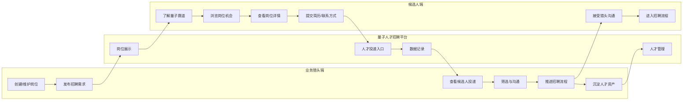

# Console｜Codex 项目级 UJ 穿透审计提示词

> 审计对象：`leishi335-cell/leishi335-cell-quantum-talent-console`
>
> 审计目标：站在真实猎头顾问/运营使用视角，对 Console 做一次项目级穿透审计，确保从“创建/维护岗位 → 发布 → 收到投递 → 筛选沟通 → 推进招聘 → 沉淀人才”这条 User Journey 不出现断点、假链路、状态错配、重复数据或数据无法回流。

---

## 0. 你的角色与审计方式

你现在不是继续做 UI 优化，而是作为 **资深 Staff Engineer + 招聘科技产品架构师 + QA/可靠性审计负责人**，对当前 Console main 分支做一次真实业务链路审计。

事实优先级：

1. 当前 main 分支源码；
2. 当前 Supabase 真实表结构、约束、RPC、RLS；
3. 当前 API/Service/Repository 实际行为；
4. 当前页面交互；
5. README / docs 只作辅助，若冲突，以代码与数据库为准。

不要只读文档后给结论，不要只做代码风格 review。

必须沿着：

**页面 → API Route → Validation → Service → Repository → Supabase → 下一业务节点**

逐段验证。

本轮先审计，不要未经确认直接大规模重构。

发现问题必须给出：

- 触发条件；
- 根因；
- 影响范围；
- P0/P1/P2；
- 涉及文件；
- 修复建议；
- 验收 Case。

---

# 1. 共同业务 UJ 基线

Console 重点负责：

**H1 → H2 → P1**

以及：

**P3 → H3 → H4 → H5 → H6 → P4**。

你要证明这些不是页面按钮，而是真实可执行的业务链路。

---

# 2. Console 当前责任边界

Console 是猎头/运营内部中台，核心对象包括：

- Company
- Job
- JobPublication
- Lead
- Talent
- Application
- StageEvent
- Analytics

重点业务语义：

- Job = 客户真实招聘需求；
- JobPublication = 对候选人公开展示版本；
- Lead = 候选人公开投递/线索；
- Talent = 可长期沉淀的人才资产；
- Application = Talent × Job 的独立推进记录；
- StageEvent = 招聘状态流转历史。

当前 Track 规则：

- `superconducting`
- `ion-trap`
- `photonics`
- `communication-sensing`
- `track=null` 合法。

不要重新发明 taxonomy。

---

# 3. 必须穿透审计的猎头主链路

## 3.1 创建/维护岗位

验证：

- Company → Job 创建是否真实落库；
- Job 必填项是否前后端一致；
- Job 编辑是否可能覆盖不该修改字段；
- Job 状态是否真实保存；
- Job 删除/关闭是否对 Publication/Application 有合理影响；
- Job 与 Company 关系是否可出现 orphan；
- 同一客户同一岗位重复创建是否有风险；
- 页面显示与数据库字段是否一致。

重点检查：

- `src/app/(console)/jobs/**`
- `/api/jobs/**`
- validation schemas
- JobService / JobRepository

---

## 3.2 Job → Publication → 发布 Showcase

这是跨系统最核心入口。

必须验证：

- 一个 Job 如何产生 JobPublication；
- Publication 编辑/发布是否真实写入数据库；
- `status=published` 后 Showcase 是否真实可见；
- `offline/archived` 后 Showcase 是否立即不可见；
- 发布失败是否会出现 Console 显示“已发布”但数据库没成功；
- track=null 是否允许发布；
- 非法 track 是否阻止发布；
- urgent/featured 是否与发布状态正交；
- 急招开始/结束时间是否正确；
- 急招过期是否只退出“急招”，而不是下架；
- `public_title/city/education/experience/responsibilities/requirements` 等公开字段是否完整；
- 是否存在“内部 Job 更新后 Publication 被意外同步覆盖”或“应该同步但没同步”的不清晰行为。

重点检查：

- `src/app/(console)/publications/**`
- `/api/publications/**`
- PublicationService
- PublicationRepository
- validation
- Supabase `job_publications`

---

## 3.3 Showcase 投递 → Lead 到达 Console

这是当前平台最需要证明的跨端闭环。

必须回答：

1. Showcase `public_submit_application` 写入的 Lead，Console 是否能稳定读取？
2. Console Lead 列表是否真的来自 Supabase，而非 Mock/静态数据？
3. Lead 的 publication_id/site_id/source/contact/resume_url/notes 等字段是否正确解析？
4. 新 Lead 是否会因为分页/筛选/状态默认值而“落库但看不到”？
5. 是否存在字段类型/命名漂移导致 Console 丢字段？
6. Lead 列表和详情是否能追溯到具体 Publication/Job？
7. Offline 后已有 Lead 是否仍应保留并可处理？

重点检查：

- `src/app/(console)/leads/**`
- `/api/leads/**`
- LeadService / LeadRepository
- Supabase `leads`
- Showcase RPC 数据契约

---

## 3.4 Lead → Talent

必须确认产品当前真实行为，而不是按 docs 猜。

验证：

- Lead 是否存在明确“转为 Talent”动作；
- 转换后是否真的新增/关联 Talent；
- 原 Lead 是否保留；
- 同一手机号/邮箱重复 Lead 是否会生成多个 Talent；
- 是否有去重或人工确认策略；
- 转换失败是否会出现半成功状态；
- 是否可能 Talent 已创建但 Lead 页面仍显示未转换；
- Talent 的姓名/联系方式/简历来源是否完整继承；
- 是否支持没有完整联系方式的 Lead。

如果当前根本没有 Lead→Talent 的实现，请明确标记为 **UJ 断点**，不要拿未来规划当已实现。

---

## 3.5 Talent + Job → Application

这是招聘推进核心中间对象。

必须验证：

- 如何从 Talent 与 Job 创建 Application；
- 是否能追溯来源 Lead；
- 同一 Talent × 同一 Job 是否允许重复 Application；
- 同一 Talent × 不同 Job 是否能独立推进；
- Application 初始 Stage 是否统一；
- 创建失败是否幂等；
- 是否存在 UI 已显示推进但 applications 表仍为 0 的假链路。

重点检查：

- Applications 页面
- API
- ApplicationService / Repository
- Supabase `applications`

---

## 3.6 招聘状态推进

当前预期流程至少应核验：

`matching → contacting → interested → recommended → client_review → interview → offer → hired`

并考虑：

`rejected / withdrawn`

必须验证：

- 状态机的唯一 Source of Truth 在哪里；
- UI 能否绕过 Service 直接写 stage；
- 非法跳转是否被拒绝；
- 每次合法跳转是否生成 StageEvent；
- Application 当前 stage 与最新 StageEvent 是否可能不一致；
- transition RPC 与 Service Layer 是否存在两套实现冲突；
- 重复点击推进是否产生重复事件；
- hired/rejected/withdrawn 后是否还可继续推进；
- 失败时是否回滚，避免“stage 改了但 event 没写”。

重点检查：

- Pipeline
- ApplicationService
- `transition_application_stage` RPC
- `stage_events`

---

## 3.7 沉淀人才资产

必须验证：

- hired/rejected/withdrawn 后 Talent 是否仍保留；
- Talent 是否可被未来其他 Job 再次匹配；
- Talent 是否有来源、历史推进记录；
- 是否因删除 Lead/Job 导致人才历史链断裂；
- 是否有重复 Talent 污染资产库风险；
- 资产沉淀是“真实数据库对象”，还是只有页面概念。

---

# 4. 跨系统契约审计

Console 与 Showcase/Supabase 的契约必须统一。

重点回答：

1. JobPublication 的字段定义两边是否一致？
2. `published/offline/archived` 是否在两边同义？
3. `urgent/featured/track` 是否同义？
4. Console 是否还有自己一套 `/api/public/*`，与 Showcase 重复？
5. 若两边都实现 public API，谁是生产 Source of Truth？
6. Console 的 `PublicApiService.applyForJob` 与 Showcase 的 RPC `public_submit_application` 是否行为不同？
7. 是否存在一个创建 Lead、另一个创建 Lead+Application 的文档/代码漂移？
8. 哪些 DTO/Validation/Mapper 已经发生复制粘贴式分叉？
9. 是否需要未来统一 public contract，但本轮只给建议，不擅自重构。

必须给代码证据。

---

# 5. Supabase 实际状态审计

不要相信旧 `DATABASE_REALITY.md`。

必须直接核验当前数据库：

- 表是否存在；
- ID 类型；
- nullable；
- FK；
- UNIQUE；
- CHECK；
- RLS；
- GRANT；
- RPC；
- 当前记录数；
- 当前 stage/status 分布。

特别核验：

- companies
- jobs
- job_publications
- leads
- talents
- applications
- stage_events
- analytics_events

并回答：

> 当前真实数据是否证明 UJ 已经跑通过一次？

例如如果 `leads>0`、`talents>0`，但 `applications=0`、`stage_events=0`，就要明确指出闭环实际停在哪里。

---

# 6. 事务、幂等与一致性审计

真实使用后最容易出问题的是“半成功”。必须检查：

- 发布 Publication 是否原子；
- Lead→Talent 是否可能重复；
- Talent→Application 是否可能重复；
- Stage transition 是否 Application 更新成功但 StageEvent 失败；
- 网络重试是否重复创建；
- 前端连续点击是否重复提交；
- Service 是否有 transaction；
- RPC 是否承担原子性；
- 是否有 UNIQUE constraint 兜底；
- 删除/下架是否造成 orphan。

每个关键写操作都要说明：

**是否幂等？是否原子？失败如何恢复？**

---

# 7. 权限与数据安全

Console 是内部系统，但不能默认“内部就安全”。

检查：

- Console API 是否真的有 Auth Guard；
- 未登录能否读 companies/jobs/talents/leads；
- 写 API 是否鉴权；
- 是否只靠前端隐藏按钮；
- Supabase anon 是否能读取内部表；
- Publishable key 是否能绕过 Console；
- service role 是否暴露到浏览器；
- Public API 是否意外泄露内部公司名/notes/owner；
- 上传简历/联系方式是否有访问控制；
- error body 是否泄露 SQL/Supabase details。

---

# 8. UI 不是重点，但要审“操作是否可信”

不要再评价颜色、圆角。

只看业务操作可信度：

- 页面按钮是否真的对应 API；
- loading 时是否可重复点击；
- success toast 是否在数据库成功前提前出现；
- error 后 UI 是否错误更新本地状态；
- 列表 refresh 后是否和数据库一致；
- filter/pagination 是否让新数据“看似丢失”；
- Sticky Table 等 UI 改造是否影响 checkbox、row click、operation click。

---

# 9. 必须设计/执行的真实 UAT

### UAT-C1｜创建并发布普通岗位

Company → Job → Publication → Published → Showcase 岗位中心可见。

### UAT-C2｜track=null

Publication 可发布 → Showcase 岗位中心可见 → 不进入前沿赛道。

### UAT-C3｜急招

Published → urgent=true + 有效 expires_at → Showcase 急招可见；到期后仅退出急招。

### UAT-C4｜精选

featured=true → Showcase 精选可见。

### UAT-C5｜下架

Published → Offline → Showcase 所有入口与直接详情均不可见，但历史 Lead 保留。

### UAT-C6｜真实投递回流

Showcase 提交 → Supabase Lead 新增 → Console Leads 可见，字段完整。

### UAT-C7｜Lead→Talent

执行转换 → Talent 真实新增/关联 → 重复转换有防护。

### UAT-C8｜Talent→Application

选择 Job 推进 → Application 真实创建 → 同人同岗重复受控。

### UAT-C9｜Stage 推进

合法 stage 逐步推进 → 每步 StageEvent 落库 → 非法跳转被拒绝。

### UAT-C10｜异常恢复

模拟 API/DB 失败 → 不产生半成功、不产生错误 toast、不产生重复记录。

---

# 10. 最终输出格式

## A. 执行摘要

一句话判断：

- UJ 当前闭环到哪一步；
- 是否适合真实猎头使用；
- 最大风险是什么。

## B. UJ 状态表

| 节点 | 状态 | 真实实现 | 数据证据 | 风险 |
|---|---|---|---|---|
| 创建岗位 | ✅/⚠️/❌ | | | |
| 发布岗位 | | | | |
| Showcase 可见 | | | | |
| Lead 回流 | | | | |
| Lead→Talent | | | | |
| Talent→Application | | | | |
| Stage 推进 | | | | |
| 人才沉淀 | | | | |

## C. P0/P1/P2 问题清单

每条写：

- 根因
- 触发路径
- 文件/表/RPC
- 数据影响
- 修复建议
- 验收 Case

## D. 跨系统数据契约

至少画清：

`Company → Job → JobPublication → Showcase → Lead → Talent → Application → StageEvent`

列关键主键/FK/状态字段。

## E. 一致性风险

单独列：

- 重复 API
- 重复 DTO
- 重复状态机
- 文档漂移
- 无事务写入
- 无唯一约束

## F. 修复路线

给出：

**P0 先修 → P1 再修 → P2 最后修**。

## G. UAT Checklist

给一份可逐条执行的端到端回归测试清单。

---

# 11. 审计底线

不要因为：

- 页面能打开；
- 按钮能点击；
- Console 有列表；
- docs 写了流程；

就判定 UJ 闭环。

真正通过的标准是：

> 猎头能创建真实岗位 → 发布后候选人真实可见 → 候选人真实投递 → Console 真实收到 Lead → 能转为人才并创建独立推进记录 → 状态变化真实落库且有历史 → 最终人才仍能作为长期资产复用；整个过程中没有静默失败、重复数据、权限泄露或跨系统状态不一致。
